# TEDUN - Digital Electronics Development Board

## 📌 Overview
The **TEDUN (Tarjeta de Electrónica Digital de la UNAL)** is an academic project developed as part of an Embedded Systems course in Electronic Engineering.

> ⚠️ Note: The project name does not represent an official product of UNAL. It only reflects the academic context in which it was developed.

This project consists of the design and implementation of a **custom development board** based on:
- A **F133A RISC-V processor**
- A **Trion T8Q144C3 FPGA**

The board enables hardware experimentation with multiple modules (Bluetooth, audio, infrared, etc.) using communication protocols such as **UART, I2S, SPI**, and **GPIO**.

---

## 🎯 Objectives
- Design a complete embedded development board
- Enable communication between a processor and an FPGA
- Support hardware testing using multiple digital interfaces
- Develop schematics and PCB using KiCad
- Implement FPGA programming using open-source tools

---

## ⚙️ Key Features

- Powered via **Micro-USB (~5V)**
- Boot via **SD card with Tina Linux**
- UART communication with a computer (via USB-UART converter)
- FPGA programming using **OpenOCD (JTAG)**
- Communication between F133A and FPGA via **UART or SPI**
- 32 GPIO pins organized in **4 banks (3.3V + 5V output)**

---

## 🏗️ System Architecture

The system integrates:
- F133A processor (RISC-V)
- Trion T8 FPGA
- SD card storage
- Multiple communication interfaces

### Interfaces

#### 🔹 JTAG
Used to program the FPGA through OpenOCD running on the F133A.

#### 🔹 SD Card
Stores:
- Tina Linux OS
- Boot partitions
- Drivers and applications
- FPGA configuration files

#### 🔹 UART & I2S
- UART for communication with PC and FPGA
- I2S for audio/data transmission

#### 🔹 GPIO
- 32 configurable pins
- Used for hardware testing and module integration

---

## 🧩 Block Diagram

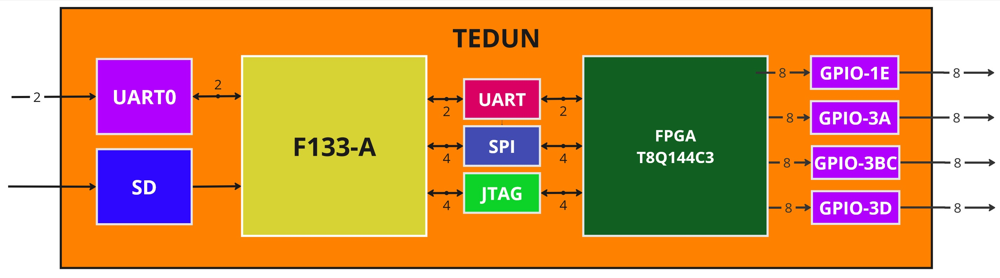

---

## 🔌 Interface Design

To validate the system, an **LctechPi board (F133A-based)** was used for testing.

Key points:
- Tina Linux was configured and deployed
- Required system packages were installed
- WiFi was tested but not included (cost optimization)

### Tool Selection

Two tools were evaluated:

#### ❌ openFPGALoader
- Supports Trion FPGA
- Limited to memory-based programming (Flash)
- ❌ Not suitable for JTAG-based programming via F133A

#### ✅ OpenOCD
- Open-source
- Supports JTAG
- Compatible with Trion FPGA
- ✔️ Selected solution

---

## 🧪 FPGA Programming with OpenOCD

OpenOCD was compiled for RISC-V and deployed on the board.

### Setup Steps:
1. Compile OpenOCD from source:
   https://github.com/riscv/riscv-openocd

2. Copy binary to:
/bin/

3. Copy scripts to:
/usr/local/share/openocd/scripts

4. Create configuration file:
openocd.cfg

### Example Configuration (JTAG via GPIO)

```bash
adapter driver sysfsgpio
transport select jtag
sysfsgpio jtag_nums 2 3 1 4

set CHIPNAME fpga_trion
source [find fpga/efinix_trion.cfg]

init
pld load fpga_trion.pld GPIO_demo.bit
```

## 🛠️ Hardware Design

The hardware design is based on:

- MangoPi (F133A reference)

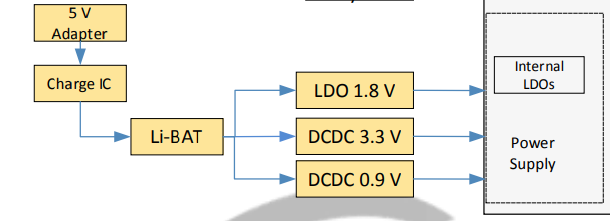

- LctechPi board

- Trion T8 FPGA reference boards

## 🔋 Power Supply

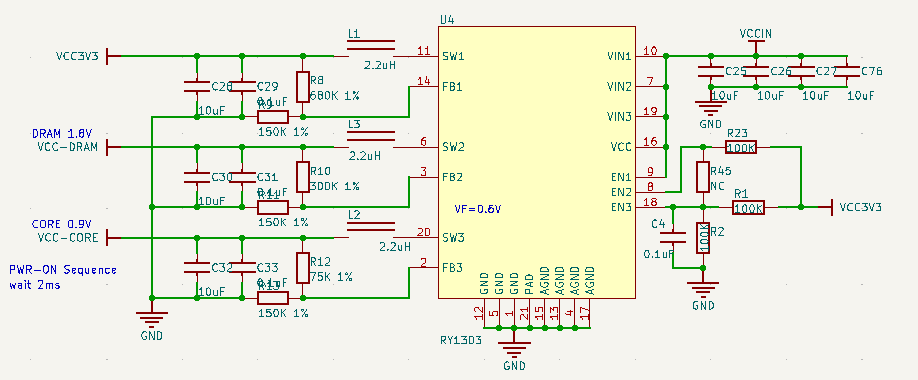

- Input: Micro-USB (5V)
- Regulation using:
  - AMS1117 (instead of RY1303 from the MangoPi board)
  - Multiple LDO regulators

## Voltage Levels:
- 3.3V → I/O, GPIO, oscillator

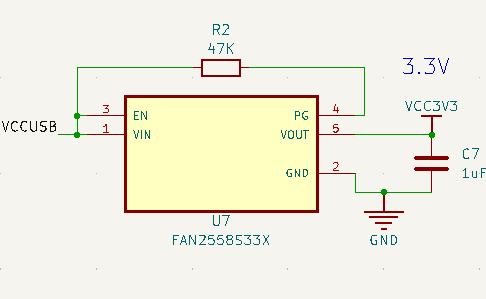

- 1.8V → DRAM

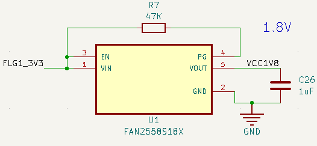

- 2.8V → Communication block (PE)

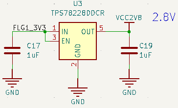

- 1.2V → FPGA core

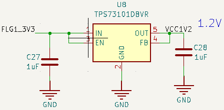

- 0.9V → Processor core

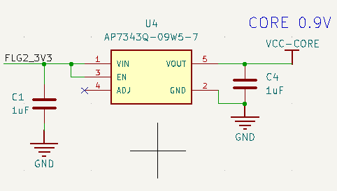

## ⚡ Power Sequencing

Implemented using:
- LM3880 power sequencer

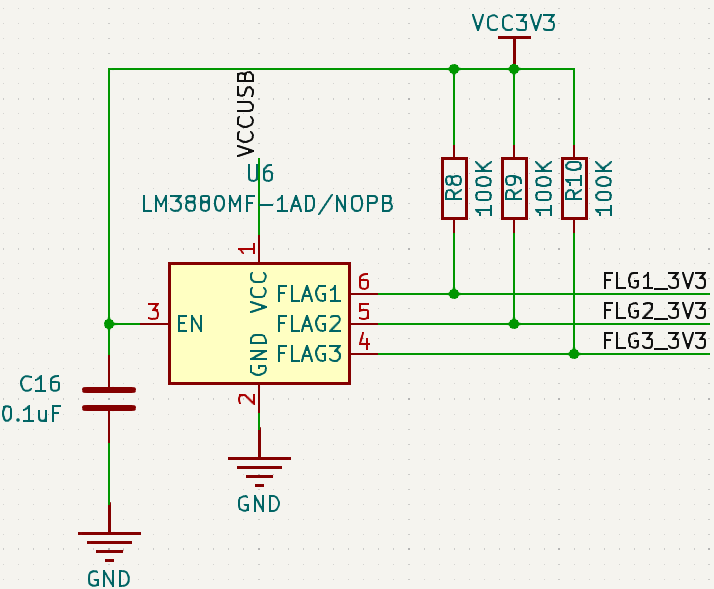

Sequence: 
1. Enable FPGA + DRAM + PE
2. Enable processor core (0.9V)
3. Enable FPGA I/O

## 💾 SD Card
- Used for booting Tina Linux
- Based on MangoPi reference design

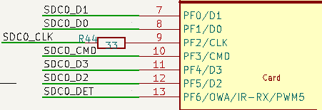

- Direct connection to F133A

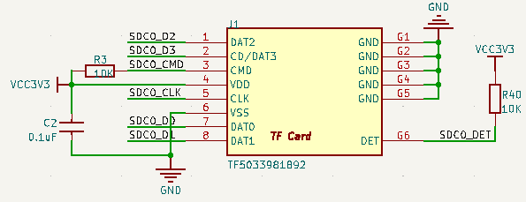

## 🧠 F133A Connections

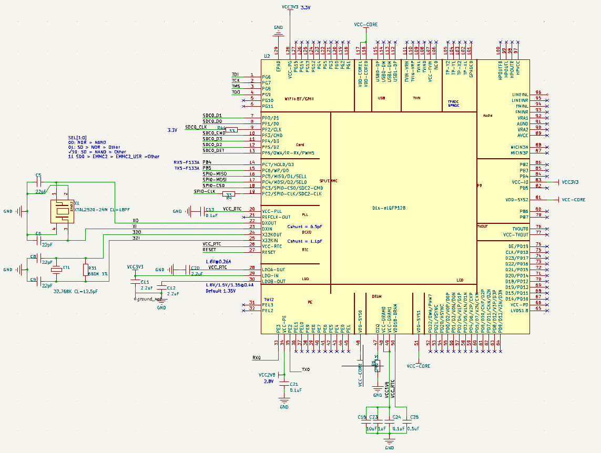

- JTAG → PG6–PG9
- UART0 → PE2 / PE3
- UART → PC6 / PC7
- SD → PF0–PF6
- SPI → PC2–PC7

## 🔲 FPGA (Trion T8)

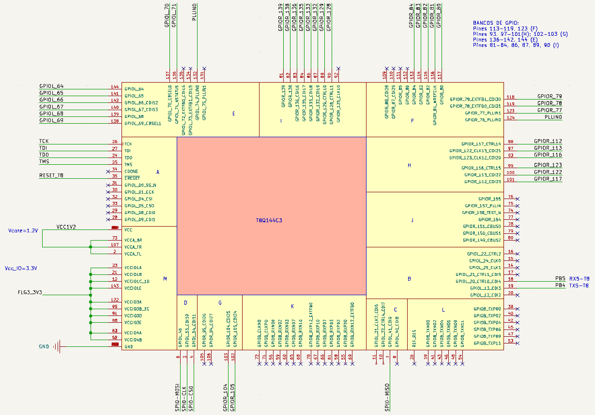

- 13 banks available
- Selected banks: 1A, 3A, 3BC, 3D
- Supports:
  - JTAG programming
  - SPI & UART communication
  - GPIO expansion

## 🔌 GPIO

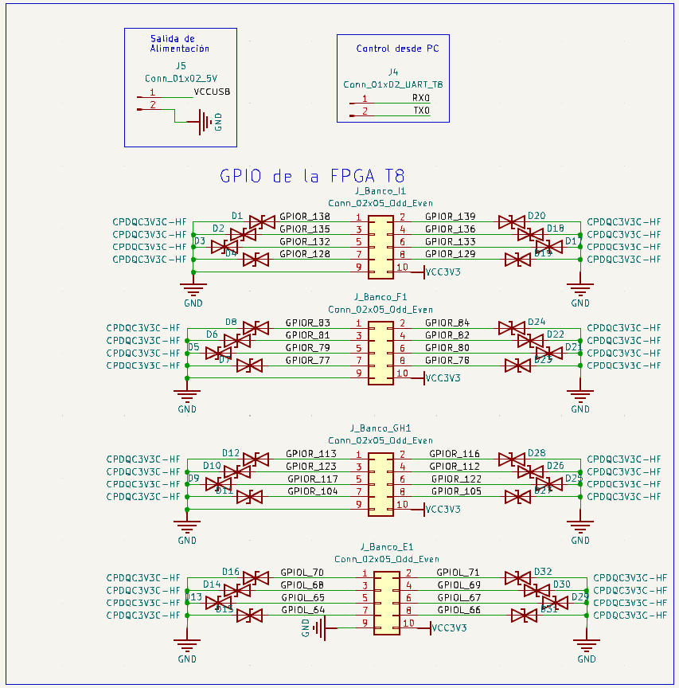

- 32 GPIO pins (4 banks × 8 pins)
- Each bank includes:
  - 3.3V output
  - GND
- Additional:
  - 5V output
  - UART interface
## ⏱️ Oscillators
- FPGA: 25 MHz oscillator

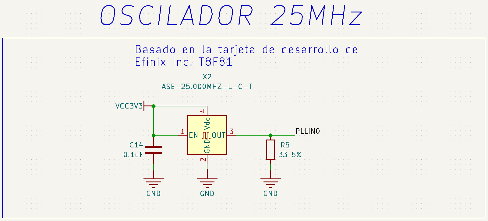

- Processor: MangoPi reference oscillator

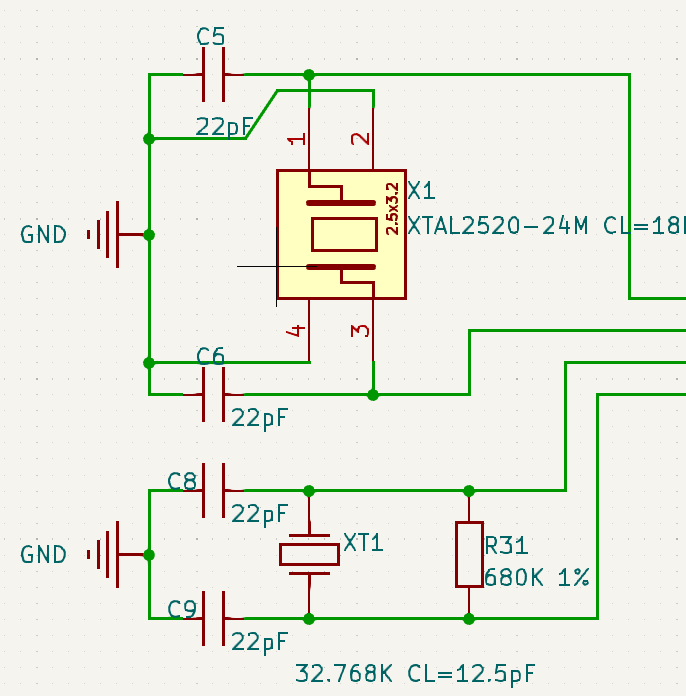

## 🧾 PCB Design


Designed in KiCad:
- Compact layout
- Optimized routing
- 3D visualization available


## 📍 Pinout


- 32 GPIO pins available
- Organized in 4 banks
- Flexible usage:
  - GPIO
  - Communication interfaces
  - Special FPGA functions

## 📚 References
- F133A Datasheet
- Trion T8 Datasheet
- MangoPi Schematics

## 🧰 Tools & Technologies
- KiCad (PCB design)
- OpenOCD (FPGA programming)
- Tina Linux
- RISC-V architecture
- Embedded Linux

## 🚀 Skills Demonstrated
- Embedded Systems Design
- FPGA Integration
- Hardware Architecture
- PCB Design (KiCad)
- Power Electronics (LDO, sequencing)
- Communication Protocols (UART, SPI, I2S, JTAG)

## 👤 Authors

- Angel RUIZ
- Santiago DIAZ
- Daniel CELY
