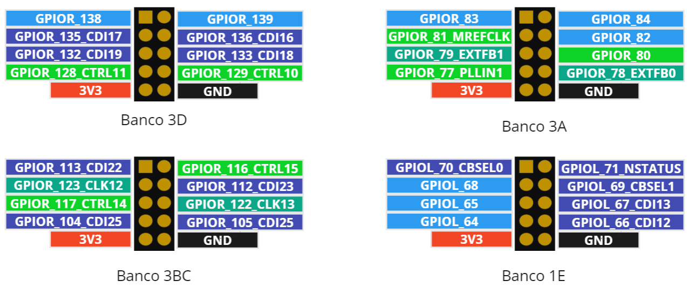
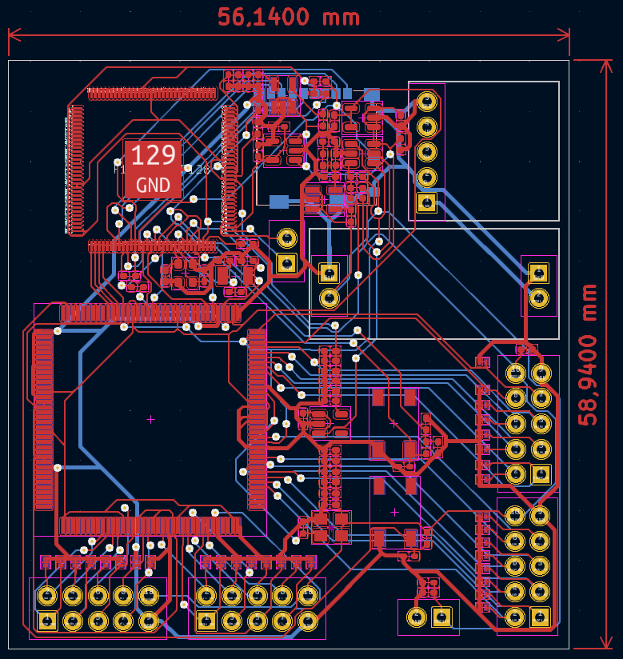
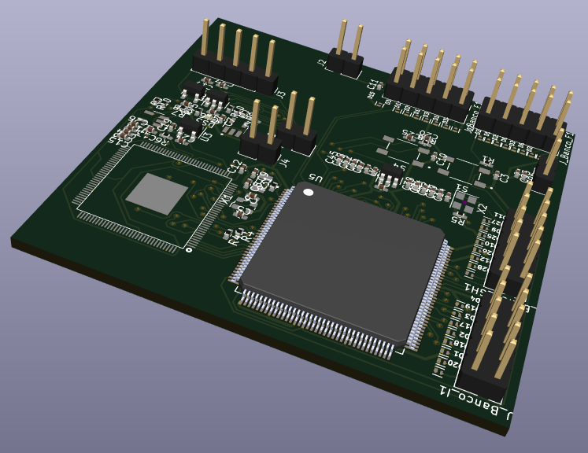
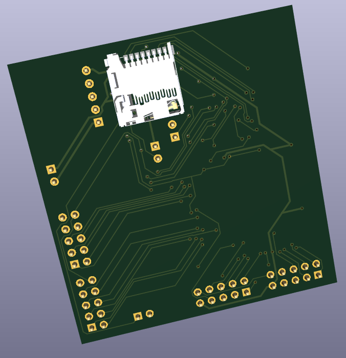

# Hardware Design

## Power Supply

The power supply design of the TEDUN board is based on reference schematics from existing boards using the F133A processor.

### Power Supply Design

The system is powered through a **Micro-USB connector**, providing approximately 5V. However, measurements showed that the input voltage can vary between **6V and 6.7V**, making voltage regulation essential.

To ensure stable operation, the design includes:

- An **AMS1117 voltage regulator** to stabilize the input voltage to 5V
- Multiple **Low Dropout Regulators (LDOs)** to generate required voltage levels

### Voltage Levels

The system requires multiple voltage domains:

- **3.3V** → GPIO, I/O, oscillator, and internal LDO supply
- **1.8V** → DRAM power supply
- **2.8V** → Processor communication block (PE)
- **1.2V** → FPGA core voltage (within recommended range 1.15V–1.25V)
- **0.9V** → Processor core (F133A)

Each voltage rail includes **parallel capacitors** for stability and noise reduction.

### Components Used

- AMS1117 (5V regulation, instead of RY1303 from the MangoPi board)
- FAN2558S33X (3.3V)
- FAN2558S18X (1.8V)
- TPS78228DDCR (2.8V)
- TPS73101DBVR (1.2V)
- AP7343Q-09W5-7 (0.9V)

---

## Power Sequencing

Proper power sequencing is critical when integrating both the **F133A processor** and the **Trion T8 FPGA**, as each component has specific startup requirements.

To ensure a safe and correct startup sequence, the design uses the:

- **LM3880 Power Sequencer**

### Sequence Description

The power-up sequence is controlled using three signals:

1. **FLG1_3V3**
   - Activates first
   - Powers:
     - FPGA core (1.2V)
     - DRAM (1.8V)
     - Processor communication block (2.8V)

2. **FLG2_3V3**
   - Activates second
   - Powers:
     - Processor core (0.9V)

3. **FLG3_3V3**
   - Activates last
   - Powers:
     - FPGA I/O (VCCIO)

This sequence ensures compliance with both **F133A** and **FPGA T8** requirements.

> Note: No specific power-down sequence is required.

---

## FPGA Design (Trion T8)

The selected FPGA is the **Trion T8Q144C3**, which provides multiple configurable I/O banks and dedicated functional pins.

### Key Features

- 13 available banks
- Multiple pin functionalities:
  - Configuration
  - GPIO
  - LVDS
  - JTAG
  - Power

### Design Choices

Based on the FPGA packaging and datasheet analysis, the following banks were selected for GPIO usage:

- **Bank 1A**
- **Bank 3A**
- **Bank 3BC**
- **Bank 3D**

### Implemented Connections

- **JTAG pins** → Used for FPGA programming
- **SPI interface (4 pins)** → Communication with F133A
- **UART interface (2 pins)** → Communication with F133A
- **32 GPIO pins** → External hardware interaction
- **Clock input (CLK)** → External oscillator
- **Reset and configuration pins**

This configuration allows flexible use of the FPGA for multiple hardware experiments.

---

## PCB Design

After defining the schematics, the PCB layout was designed using **KiCad**.

### Design Goals

- Compact board size
- Optimized routing between components
- Clear separation of power and signal paths
- Reliable connections between processor and FPGA

### Features

- Dedicated power planes
- Organized GPIO pin headers

### Outputs

The final design includes:

- Complete schematic (Files in the [Hardware](../hardware/) folder)

- PCB layout

- 3D visualization of the board

